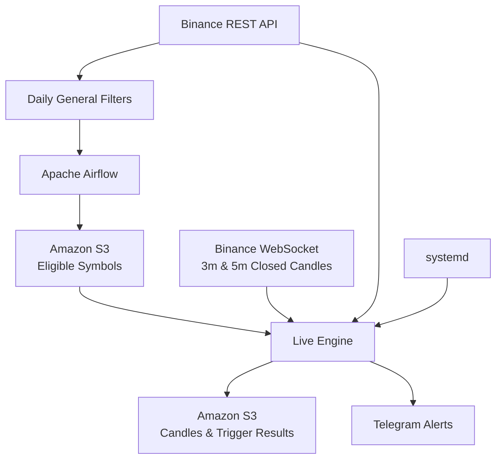

# TG Alerts — Binance Market Monitoring & Telegram Alert System

A Python-based crypto market monitoring system that uses the Binance public API to identify active USDT spot markets, stream live candlestick data, detect predefined technical patterns, and send real-time Telegram alerts.

The project combines scheduled batch processing with a continuously running WebSocket service:

- **Apache Airflow** runs the daily market filtering workflow.
- **Binance REST API** is used for market metadata, historical candles, and recovery backfills.
- **Binance WebSocket streams** provide live 3-minute and 5-minute closed-candle data.
- **Amazon S3** stores filters, candles, logs, and alert outputs.
- **systemd** keeps the live engine running continuously on an AWS EC2 instance.
- **Telegram Bot API** delivers real-time alerts.

> This project is for market monitoring and research. It does not execute trades.

---

## Architecture



The system has two main components:

1. **Daily filtering pipeline**  
   Determines which Binance USDT spot markets are active enough to monitor.

2. **Live trigger engine**  
   Streams closed candles for the selected symbols, maintains recent history, evaluates trigger conditions, and sends Telegram alerts.

---

## Repository Structure

```text
.
├── crypto-general-filters.py
├── crypto-live-engine-triggers.py
├── tg_alerts_general_filters_daily_dag.py
├── README.md
└── .gitignore
```

### `crypto-general-filters.py`

Runs the daily market-selection logic.

Main responsibilities:

- Retrieves Binance exchange information.
- Keeps active USDT spot markets.
- Excludes stablecoin / fiat-like base assets.
- Applies minimum 24-hour quote-volume requirements.
- Measures recent price movement.
- Builds custom 10-minute candles from completed 5-minute candles.
- Applies recent-activity filters.
- Writes the final eligible-symbol list to Amazon S3.

### `tg_alerts_general_filters_daily_dag.py`

Apache Airflow DAG responsible for orchestration.

The DAG:

- Runs once per day at **01:00 UTC**.
- Executes the general-filter Python script.
- Keeps scheduling logic separate from the market-processing logic.

This separation makes the filtering code easier to run, test, and debug independently of Airflow.

### `crypto-live-engine-triggers.py`

Continuously running live market-monitoring service.

Main responsibilities:

- Loads the latest eligible-symbol list from S3.
- Subscribes to Binance WebSocket kline streams.
- Processes only **closed 3-minute and 5-minute candles**.
- Stores candle history in S3.
- Maintains recent candle history in memory for trigger calculations.
- Detects technical trigger patterns.
- Writes trigger results to S3.
- Sends Telegram alerts.
- Detects unhealthy WebSocket connections and allows `systemd` to restart the service automatically.
- Backfills recent missing candles through the Binance REST API after restart.

---

## Market Filtering Logic

The daily general filter starts with Binance spot markets and applies several conditions.

### Base market filters

A symbol must:

- Use `USDT` as the quote asset.
- Have Binance status `TRADING`.
- Allow spot trading.
- Not use an excluded stablecoin / fiat-like base asset.
- Have at least **1,000,000 USDT** in 24-hour quote volume.

### Price-movement filter

A symbol must satisfy at least one of:

- 6-hour price range >= **3%**
- 12-hour price range >= **6%**

### Recent-activity filter

Because Binance does not provide a native 10-minute kline interval, the script builds each 10-minute candle from two completed 5-minute candles.

For the previous 12 custom 10-minute candles:

```text
range % = (high - low) / open × 100
```

The symbol passes when the average range is at least **0.5%**.

---

## Live Trigger Engine

The live engine monitors:

```text
3m
5m
```

Binance WebSocket streams are used for real-time data, and only completed candles are evaluated.

### Trigger 1 — Swing-Low Breakdown

A seven-candle pattern is used to identify a confirmed swing low.

The setup includes:

- Three descending closes before the swing low.
- A local minimum at candle 4.
- Three ascending closes after the swing low.
- The swing-low close must be below the previous 40 closes.
- Swing depth must be large enough relative to recent average candle bodies.

After a swing low is confirmed, a future candle can trigger an alert when:

- Its close breaks below the swing-low price.
- Its quote volume is above the recent average.

### Trigger 2 — Upper-Wick Rejection

A three-candle pattern designed to identify strong rejection after upward momentum.

The setup includes:

- Three consecutive rising closes.
- A new high close relative to the recent lookback.
- A large upper wick relative to the candle body.
- A very small lower wick.
- Elevated candle-body size and quote volume.

The entry / trigger price is the close of the third candle.

---

## WebSocket Recovery and Backfill

A continuously running WebSocket process can remain alive even when the underlying connection has stopped delivering useful data. The live engine therefore includes an application-level health check.

If the WebSocket becomes unhealthy:

1. The live engine intentionally terminates.
2. `systemd` automatically restarts the process.
3. Recent candle files are loaded from S3.
4. The latest expected closed candles are checked.
5. Missing candles are fetched from Binance REST API.
6. Repaired candle data is merged and saved back to S3.
7. The WebSocket connection starts again.

Recent restored candles are used as calculation context for 40-candle lookbacks.

Historical downtime data is **not replayed to generate delayed Telegram alerts**, preventing stale catch-up notifications.

---

## AWS Components

### Amazon EC2

The Python services run on an Ubuntu EC2 instance.

Two independent workloads are used:

- Apache Airflow for scheduled orchestration.
- A `systemd` service for the continuously running WebSocket engine.

### Amazon S3

S3 is used as persistent storage for:

- General-filter outputs.
- Recent activity logs.
- 3-minute and 5-minute candles.
- Swing-low results.
- Trigger results.
- Telegram alert records.

Candle data is partitioned by interval, date, and candle time.

Example:

```text
candles/
└── interval=3m/
    └── candle_date=YYYY-MM-DD/
        └── candle_time=HHMM/
            └── candles.csv
```

S3 provides persistent history, while the running Python process keeps only the recent working set required for trigger calculations in memory.

---

## Installation

Clone the repository:

```bash
git clone <repository-url>
cd <repository-name>
```

Create and activate a virtual environment:

```bash
python -m venv venv
source venv/bin/activate
```

Install the main Python dependencies:

```bash
pip install pandas requests boto3 websocket-client apache-airflow
```

AWS authentication should be configured through an IAM role when running on EC2.

---

## Environment Variables

Telegram credentials must not be hardcoded in source code.

The live engine reads:

```text
TELEGRAM_BOT_TOKEN
TELEGRAM_CHAT_ID
```

Example shell configuration:

```bash
export TELEGRAM_BOT_TOKEN="your_bot_token"
export TELEGRAM_CHAT_ID="your_chat_id"
```

For a production EC2 deployment, credentials can be provided through a protected environment file used by the `systemd` service.

Do **not** commit:

- `.env` files
- Telegram bot tokens
- AWS access keys
- AWS secret keys
- private SSH keys
- local virtual environments

---

## Running the Components

### Run the general filter manually

```bash
python crypto-general-filters.py
```

### Run the live engine manually

```bash
python crypto-live-engine-triggers.py
```

In production, the live engine is better run as a supervised background service such as `systemd`.

### Airflow

The Airflow DAG schedules the general-filter workflow once per day.

```text
Schedule: 0 1 * * *
Timezone: UTC
```

---

## Reliability Features

The project includes several safeguards designed for a long-running data pipeline:

- WebSocket health monitoring.
- Automatic process restart through `systemd`.
- Recent-candle recovery after restart.
- Binance REST backfill for missing candles.
- S3 merge and deduplication.
- Persistent candle storage.
- Separation between scheduled and continuously running workloads.
- Environment-variable based secret management.

---

## Technology Stack

- **Python**
- **pandas**
- **Binance REST API**
- **Binance WebSocket API**
- **Apache Airflow**
- **AWS EC2**
- **Amazon S3**
- **AWS IAM**
- **boto3**
- **systemd**
- **Telegram Bot API**
- **Git / GitHub**

---

## Design Decisions

### Why separate the production script from the Airflow DAG?

The filtering logic and orchestration logic have different responsibilities.

The Python script contains the actual data-processing logic, while the Airflow DAG determines when and how that script is executed.

Keeping them separate makes the processing code easier to:

- test locally;
- debug independently;
- reuse outside Airflow;
- maintain as the project grows.

### Why use both REST and WebSocket APIs?

The WebSocket API provides low-latency live candles, while the REST API is useful for:

- startup history;
- metadata;
- daily filters;
- recovery after connection failures;
- backfilling missing candles.

### Why use S3 and memory together?

S3 provides durable storage.

In-memory candle history provides fast access to the recent data required for rolling 40-candle calculations.

After a process restart, the necessary recent history is restored from S3.

---

## Future Improvements

Possible next steps include:

- CloudWatch health alarms and service monitoring.
- Automated tests for trigger logic.
- CI/CD workflow for deployment.
- S3 lifecycle rules for historical candle retention.
- More efficient recent-prefix S3 discovery.
- Containerization.
- Additional trigger strategies.
- Metrics dashboard for alert frequency and system health.

---

## Disclaimer

This repository is an educational and portfolio project for market-data analysis and alert generation.

It does not provide financial advice and does not execute cryptocurrency trades.
