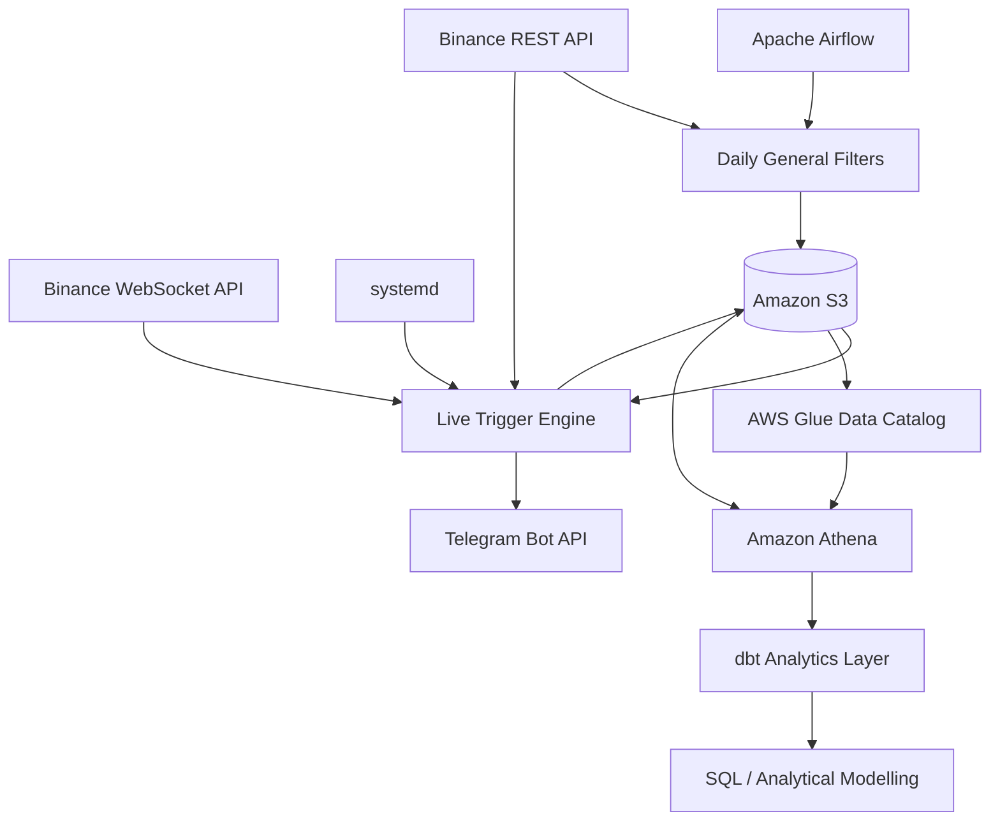

# TG Alerts — Binance Market Monitoring & Telegram Alert System

A Python-based crypto market monitoring and alerting system built around the Binance public API.

The project identifies active USDT spot markets, streams live candlestick data, detects predefined technical patterns, stores raw and processed outputs in Amazon S3, and sends real-time Telegram alerts. The collected S3 data is also exposed to Amazon Athena through the AWS Glue Data Catalog for further analysis.

> This project is intended for market-data research and portfolio demonstration. It does not execute trades or provide financial advice.

---

## Project Overview

The solution combines three different workloads:

1. **Daily market filtering**  
   Apache Airflow runs a scheduled Python workflow that identifies Binance symbols with sufficient liquidity and recent price activity.

2. **Continuous live monitoring**  
   A long-running Python service consumes Binance WebSocket streams, evaluates closed 3-minute and 5-minute candles, detects trigger patterns, and sends Telegram alerts.

3. **Post-run analytics and transformation**  
   Data stored in S3 is registered as external Athena tables through the AWS Glue Data Catalog. A dbt project then builds typed staging models, reusable intermediate models, analytics-ready marts, reusable macros, and automated data-quality / business-rule tests on top of Athena.

The production pipeline was deployed on an Ubuntu EC2 instance and used to collect a one-week market-data sample for subsequent analysis.

---

## Architecture



### Runtime separation

The project intentionally separates business logic from orchestration:

```text
Apache Airflow
      |
      v
crypto_general_filters.py
```

The Airflow DAG defines **when and how** the daily workflow runs, while the Python module contains the actual Binance filtering logic.

The live engine is different: it is a continuously running WebSocket process and therefore runs as a `systemd` service rather than as an Airflow task.

---

## Repository Structure

```text
.
├── README.md
├── LICENSE
├── .gitignore
│
├── src/
│   ├── crypto_general_filters.py
│   └── crypto_live_engine_triggers.py
│
├── dags/
│   └── tg_alerts_general_filters_daily_dag.py
│
├── sql/
│   └── athena/
│       ├── create_trigger_1_results_raw.sql
│       ├── create_trigger_2_results_raw.sql
│       ├── create_general_filters_run_summary_raw.sql
│       └── create_general_filters_symbol_processing_log_raw.sql
│
├── dbt/
│   ├── dbt_project.yml
│   ├── README.md
│   ├── models/
│   │   ├── staging/
│   │   ├── int/
│   │   └── mart/
│   ├── macros/
│   └── tests/
│
└── scripts/
    └── maintenance/
        ├── reorganize_general_filters_logs_s3.cmd
        ├── reorganize_general_filters_logs_s3.sh
        └── README.md
```

The `dbt/` directory contains the analytical transformation layer built on top of the Athena raw tables. Its own `README.md` documents the dbt models, macros, tests, and project structure in more detail.

---

## Main Components

### `src/crypto_general_filters.py`

Daily Binance market-selection workflow.

Main responsibilities:

- Retrieves Binance exchange metadata.
- Keeps active USDT spot markets.
- Excludes stablecoin / fiat-like base assets.
- Applies a minimum 24-hour quote-volume threshold.
- Evaluates recent 6-hour and 12-hour price movement.
- Builds custom 10-minute candles from completed 5-minute Binance candles.
- Applies a recent-activity filter.
- Writes the eligible-symbol output and processing logs to S3.
- Tracks active-cycle metadata for symbols that remain eligible across runs.

### `dags/tg_alerts_general_filters_daily_dag.py`

Apache Airflow orchestration layer for the general-filter workflow.

The DAG:

- Runs once per day at **01:00 UTC**.
- Executes the general-filter Python script.
- Keeps scheduling and orchestration separate from the filtering logic.

This separation makes the Python workflow easier to run, test, debug, and reuse independently of Airflow.

### `src/crypto_live_engine_triggers.py`

Continuously running live market-monitoring service.

Main responsibilities:

- Loads the latest eligible-symbol list from S3.
- Subscribes to Binance WebSocket kline streams.
- Processes only completed **3-minute and 5-minute candles**.
- Stores candle batches in S3.
- Maintains recent candle history in memory for rolling calculations.
- Detects Trigger 1 and Trigger 2 patterns.
- Saves trigger results to S3.
- Sends real-time Telegram alerts.
- Monitors WebSocket health.
- Terminates itself when the connection becomes unhealthy so that `systemd` can restart it.
- Reloads recent S3 history after restart.
- Backfills missing recent candles through the Binance REST API before live processing resumes.

---

## Daily Market Filtering

The daily filter reduces the Binance spot universe to symbols worth monitoring.

### Base filters

A symbol must:

- Use `USDT` as the quote asset.
- Have Binance status `TRADING`.
- Allow spot trading.
- Not use an excluded stablecoin / fiat-like base asset.
- Have at least **1,000,000 USDT** in 24-hour quote volume.

### Price-movement filter

A symbol must satisfy at least one of:

- 6-hour range >= **3%**
- 12-hour range >= **6%**

The rolling range is calculated as:

```text
(high - low) / low * 100
```

### Recent-activity filter

Binance does not provide a native 10-minute kline interval, so the workflow constructs each 10-minute candle from two completed 5-minute candles.

For each custom candle:

```text
range % = (high - low) / open * 100
```

The previous 12 custom 10-minute candles are evaluated, and the symbol passes when their average range is at least **0.5%**.

---

## Live Trigger Engine

### Trigger 1 — Swing-Low Breakdown

Trigger 1 is a short-side seven-candle swing-low breakdown pattern.

The swing-low setup includes:

- `C1.close > C2.close > C3.close`
- C4 is the lowest close among the seven candles.
- C4 is below each of the previous 40 closes.
- `C5.close < C6.close < C7.close`
- Swing depth is at least 2x the recent average candle body.

After the swing low has been confirmed, a future candle triggers when:

- Its close breaks below the active swing-low price.
- Its quote volume exceeds the average quote volume of the recent lookback.

The breaking candle close is used as the trigger / entry price.

### Trigger 2 — Upper-Wick Rejection

Trigger 2 is a short-side three-candle rejection pattern.

The setup includes:

- `C1.close < C2.close < C3.close`
- C3 closes above the previous 39 closes.
- C3 has a positive candle body.
- C3 upper shadow is at least 2x its body.
- C3 lower shadow is less than 15% of its body.
- C1 and C2 have elevated quote volume.
- C1 and C2 have elevated candle-body size relative to their recent lookback.

The close of C3 is used as the trigger / entry price.

---

## WebSocket Recovery and Backfill

A process can remain alive even after its WebSocket connection has stopped delivering useful data. For that reason, the live engine includes application-level health monitoring rather than relying only on process status.

Recovery flow:

```text
WebSocket becomes unhealthy
        |
        v
Live engine exits intentionally
        |
        v
systemd restarts the process
        |
        v
Recent S3 candle history is loaded
        |
        v
Recent expected candles are checked
        |
        v
Missing candles are fetched from Binance REST API
        |
        v
Recovered candles are merged back into S3
        |
        v
WebSocket live processing resumes
```

At startup, the engine loads only a bounded recent history rather than the complete S3 candle archive. This provides enough context for rolling 40-candle calculations while keeping restart time and memory usage controlled.

Backfilled historical candles are used as calculation context. The engine does **not** replay historical downtime data to generate delayed Telegram alerts.

---

## Amazon S3 Data Layout

S3 is the persistent storage layer for:

- General-filter outputs.
- General-filter processing logs.
- 3-minute and 5-minute candles.
- Swing-low search results.
- Trigger 1 results.
- Trigger 2 results.
- Telegram alert records.

### Candle partitions

```text
candles/
└── interval=3m/
    └── candle_date=YYYY-MM-DD/
        └── candle_time=HHMM/
            └── candles.csv
```

The same layout is used for the 5-minute interval.

### Trigger result partitions

```text
trigger-1-results/
└── interval=3m/
    └── trigger_date=YYYY-MM-DD/
        └── trigger_time=HHMM/
            └── triggers.csv
```

```text
trigger-2-results/
└── interval=3m/
    └── trigger_date=YYYY-MM-DD/
        └── trigger_time=HHMM/
            └── triggers.csv
```

The Hive-style `key=value` folder structure allows Athena to use `interval`, `trigger_date`, and `trigger_time` as partition columns.

### General-filter logs

The log files originally shared the same S3 partition folder despite having different CSV schemas.

They were reorganized into separate prefixes:

```text
general-filters-logs/
├── run_summary/
│   └── run_date=YYYY-MM-DD/
│       └── run_time=HHMM/
│           └── run_summary.csv
│
└── symbol_processing_log/
    └── run_date=YYYY-MM-DD/
        └── run_time=HHMM/
            └── symbol_processing_log.csv
```

This allows each log type to be exposed as an independent Athena external table.

The one-time AWS CLI migration is documented under:

```text
scripts/maintenance/
```

---

## Athena and AWS Glue Data Catalog

Athena is used to query the S3 datasets directly.

No Glue crawler is required for the current analytical layer. Instead, the repository contains explicit `CREATE EXTERNAL TABLE` statements under:

```text
sql/athena/
```

The SQL files register the raw S3 datasets in the Glue Data Catalog.

Current raw tables:

```text
funnel.trigger_1_results_raw
funnel.trigger_2_results_raw
funnel.general_filters_run_summary_raw
funnel.general_filters_symbol_processing_log_raw
```

Existing Hive-style partitions are registered with:

```sql
MSCK REPAIR TABLE <table_name>;
```

This approach keeps the table definitions explicit, reproducible, and version-controlled in Git.

The raw CSV fields are generally registered as strings first, with stronger data types applied later in analytical queries or transformation models.

---

## dbt Analytical Layer

The repository now includes a dbt project under:

```text
dbt/
```

dbt reads the Athena raw tables registered in the `funnel` schema and creates a structured transformation layer:

```text
Athena raw sources
        |
        v
dbt staging views
        |
        v
dbt intermediate views
        |
        v
dbt mart tables
```

### Raw sources

The dbt project declares four Athena sources:

```text
funnel.trigger_1_results_raw
funnel.trigger_2_results_raw
funnel.general_filters_run_summary_raw
funnel.general_filters_symbol_processing_log_raw
```

### Staging models

The staging layer standardizes the raw CSV-backed Athena tables.

Main responsibilities include:

- casting raw string values to analytical data types;
- parsing UTC timestamp strings;
- formatting `HHMM` partition values as `HH:MM`;
- converting blank strings to `NULL` where appropriate;
- using partition metadata as canonical date/time fields;
- preserving trigger and S3 lineage metadata.

Current staging models:

```text
stg_trigger_1_results
stg_trigger_2_results
stg_general_filters_run_summary
stg_general_filters_symbol_processing_log
```

Staging models are materialized as Athena views.

### Intermediate models

The intermediate layer contains reusable business logic built on top of staging models.

Current models:

```text
int_trigger_1_results
int_trigger_2_results
int_general_filters_run_summary
int_general_filters_symbol_processing_log
```

Intermediate models are materialized as views.

### Mart models

The mart layer provides analytics-ready datasets.

Current marts:

```text
mart_filters
mart_symbols
```

Mart models are materialized as tables.

### Reusable macros

Repeated staging transformations were moved into dbt macros:

```text
parse_utc_timestamp
format_hhmm
null_if_blank
```

This avoids repeating timestamp parsing, `HHMM` formatting, and blank-string cleanup logic across multiple models.

### Data tests

The project uses built-in dbt tests such as:

```text
not_null
unique
```

and custom singular SQL tests for business-rule validation.

Current custom tests include:

```text
assert_general_filter_counts_reconcile.sql
assert_percentage_of_continued_valid.sql
assert_trigger_1_rules.sql
assert_trigger_2_rules.sql
```

These tests validate:

- reconciliation between final filter counts and active-cycle groups;
- percentage values remaining within the expected 0–100 range;
- Trigger 1 results continuing to satisfy the swing-low breakdown / volume conditions;
- Trigger 2 results continuing to satisfy the three-candle rejection, wick, volume, and body conditions.

This gives the project a second validation layer: the Python services generate the operational results, while dbt independently checks the stored analytical outputs and business rules.

The dbt project is documented in more detail in:

```text
dbt/README.md
```

The resulting analytical layer supports questions such as:

- How many Trigger 1 and Trigger 2 events occurred?
- Which symbols generated the most alerts?
- How frequently did triggers occur by date and interval?
- Which general-filter runs produced the largest eligible-symbol sets?
- Which symbols repeatedly passed or failed specific filtering stages?
- How did price behave after each detected trigger?

---

## AWS Runtime Components

### Amazon EC2

The production runtime used an Ubuntu EC2 instance.

Two independent services ran on the same VM:

- **Apache Airflow** — scheduled daily filtering.
- **systemd-managed Python service** — continuous live WebSocket monitoring.

Stopping the EC2 instance stops the runtime workloads while the persistent S3 data remains available for serverless Athena analysis.

### AWS IAM

AWS permissions are provided through IAM rather than hardcoded credentials.

When running on EC2, an IAM role can provide S3 access directly to `boto3` and the AWS CLI.

---

## Environment Variables and Secrets

Telegram credentials are not hardcoded in source code.

The live engine reads:

```text
TELEGRAM_BOT_TOKEN
TELEGRAM_CHAT_ID
```

Example:

```bash
export TELEGRAM_BOT_TOKEN="your_bot_token"
export TELEGRAM_CHAT_ID="your_chat_id"
```

In the EC2 deployment, secrets can be supplied to the `systemd` service through a protected environment file.

Do **not** commit:

- `.env` files
- Telegram bot tokens
- AWS access keys
- AWS secret keys
- private SSH keys
- local virtual environments
- generated Python cache files

---

## Installation

Clone the repository:

```bash
git clone <repository-url>
cd tg_alerts
```

Create a virtual environment:

```bash
python -m venv venv
```

Activate it on Linux/macOS:

```bash
source venv/bin/activate
```

Install the main dependencies:

```bash
pip install pandas requests boto3 websocket-client apache-airflow
```

---

## Running the Python Components

### General filter

```bash
python src/crypto_general_filters.py
```

### Live engine

```bash
python src/crypto_live_engine_triggers.py
```

For production use, the live engine should run under a process supervisor such as `systemd`.

### Airflow schedule

```text
Schedule: 0 1 * * *
Timezone: UTC
```

---

## Reliability Features

The project includes:

- WebSocket health monitoring.
- Automatic process restart through `systemd`.
- Bounded recent-history loading after restart.
- Binance REST backfill for missing candles.
- S3 merge and deduplication.
- Persistent candle and trigger storage.
- Separation of scheduled and continuously running workloads.
- IAM-based AWS access.
- Environment-variable based secret management.
- Hive-style S3 partitioning.
- Version-controlled Athena table definitions.
- Version-controlled dbt transformations.
- dbt generic and custom business-rule tests.
- Reusable dbt macros for repeated transformation logic.

---

## Technology Stack

### Data collection and processing

- Python
- pandas
- requests
- boto3
- websocket-client
- Binance REST API
- Binance WebSocket API

### Orchestration and runtime

- Apache Airflow
- systemd
- Ubuntu
- Amazon EC2

### Storage and analytics

- Amazon S3
- AWS Glue Data Catalog
- Amazon Athena
- dbt Core
- dbt-athena
- AWS CLI

### Notifications and version control

- Telegram Bot API
- Git
- GitHub

---

## Design Decisions

### Why separate the production script from the Airflow DAG?

The filtering logic and orchestration logic solve different problems.

The Python module defines **what the workflow does**, while the Airflow DAG defines **when and how it runs**.

Keeping them separate improves:

- local testing;
- debugging;
- reuse;
- maintainability.

### Why is the live engine not an Airflow task?

The live engine is designed to run continuously and maintain an active WebSocket connection.

Airflow is better suited to finite scheduled workflows. A continuously running service therefore fits more naturally under `systemd`.

### Why use both Binance REST and WebSocket APIs?

The WebSocket API provides live candle events.

The REST API supports:

- exchange metadata;
- historical context;
- daily filtering;
- startup recovery;
- missing-candle backfill.

### Why use S3 and memory together?

S3 provides durable persistent storage.

In-memory history gives the running engine fast access to the recent candles required by the trigger algorithms.

After restart, recent history is restored from S3.

### Why define Athena tables manually instead of using a Glue crawler?

The S3 schemas and partition structures are known in advance.

Explicit Athena DDL provides:

- deterministic schemas;
- controlled column names and data types;
- reproducible infrastructure;
- SQL definitions that can be stored and reviewed in Git.

### Why reorganize the general-filter log prefixes?

`run_summary.csv` and `symbol_processing_log.csv` have different schemas.

Keeping both file types under the same Athena table location would mix incompatible CSV structures. Separate S3 prefixes allow each dataset to have its own external table.


### Why add dbt on top of Athena?

Athena provides direct SQL access to the raw S3 datasets, but the raw tables are intentionally close to the source files and mostly use string-based schemas.

dbt adds a version-controlled transformation layer that provides:

- typed staging models;
- reusable intermediate logic;
- analytics-ready marts;
- reusable Jinja macros;
- generic data-quality tests;
- custom business-rule tests;
- explicit model dependencies and lineage.

This keeps raw ingestion separate from analytical transformation and makes the analytics layer easier to test, review, and extend.

---

## Future Improvements

Possible next steps include:

- Evaluate post-trigger price performance over multiple time horizons.
- Convert larger analytical datasets from CSV to Parquet.
- Add an incremental dbt model for append-only historical data.
- Add dbt unit tests for transformation logic.
- Add downstream dbt exposures when dashboards or other consumers are introduced.
- Orchestrate dbt execution and testing through Airflow.
- Add CloudWatch health alarms.
- Add CI/CD for deployment and analytical validation.
- Add S3 lifecycle rules for historical candle retention.
- Improve S3 prefix discovery for long-running deployments.
- Add dashboards for trigger frequency and performance.
- Containerize runtime components.

---

## Disclaimer

This repository is an educational and portfolio project for market-data engineering, monitoring, and analysis.

It does not provide financial advice and does not execute cryptocurrency trades.
